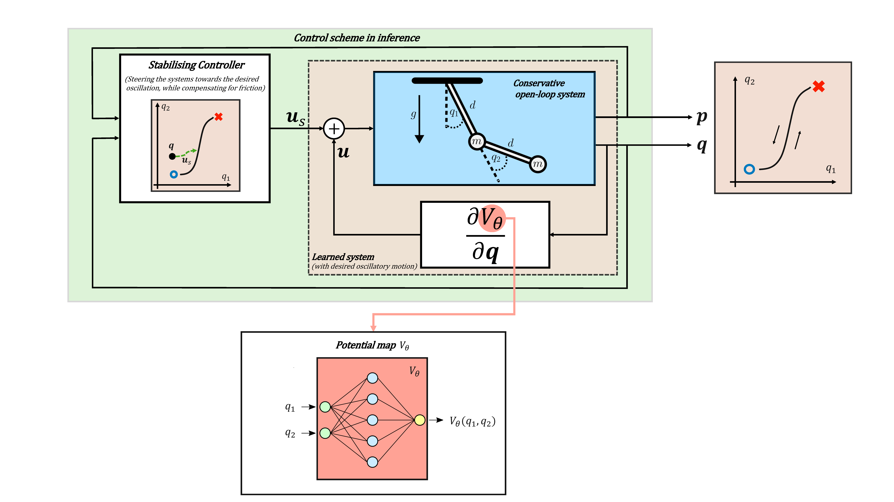

# Discovering Efficient Periodic Behaviours in Mechanical Systems via Neural Approximators

Code accompanying the paper:

**Discovering Efficient Periodic Behaviours in Mechanical Systems via Neural Approximators**\
Yannick Wotte, Sven Dummer, Nicolò Botteghi, Christoph Brune, Stefano Stramigioli, Federico Califano

The paper can be found at: [Link](https://arxiv.org/pdf/2212.14253.pdf).



**Abstract:** 
It is well known that conservative mechanical systems exhibit local oscillatory behaviours due to their elastic and gravitational potentials, which completely characterise these periodic motions together with the inertial properties of the system. 
The classification of these periodic behaviours and their geometric characterisation are in an ongoing secular debate, which recently led to the so-called eigenmanifold theory. 
The eigenmanifold characterises nonlinear oscillations as a generalisation of linear eigenspaces. With the motivation of performing periodic tasks efficiently, we use tools coming from this theory to construct an optimisation problem aimed at inducing desired closed-loop oscillations through a state feedback law. 
We solve the constructed optimisation problem via gradient-descent methods involving neural networks. Extensive simulations show the validity of the approach.

## Requirements

The used python version and the used packages:
* Python 3.9.7
* Pytorch 1.11.0
* torchdiffeq
* pytorch-lightning 1.5.10
* matplotlib

For our environments, we use conda. If one has conda installed, one can create the correct environment via the following
command:
```
conda env create -f environment.yml
```

## Learn optimal eigenmode

```bash
python learn_opt_eigenmode.py -e ${experiment_dir}
```
The -e option corresponds to the path of the experiment directory. For instance, ```-e Experiments/example_experiment```.
The experiment directory should at least contain a specs.json file specifying all the options needed for the experiment. 
An example of a specs.json file is given in ```Experiments/example_experiment```. 

## Stabilize the system on the optimal oscillatory behaviour

```bash
python stabilize_opt_eigenmode.py -e ${experiment_dir}
```

The above bash command only contains the required options. The optional arguments are:
- ```-a_E```: the $\alpha_E$ stabilizing control parameter. 
- ```-a_M```: the $\alpha_M$ stabilizing control parameter. 
- ```-b```: the constant $b$ in the paper, which represents the amount of damping present in the system. 
- ```-q0_1```: the starting value of the angle $q_1$ of our controlled trajectory.
- ```-q0_2```: the starting value of the angle $q_2$ of our controlled trajectory.
- ```-p0_1```: the starting value of the momentum of $q_1$ (so the starting value of $p_1$) of our controlled trajectory.
- ```-p0_2```: the starting value of the momentum of $q_2$ (so the starting value of $p_2$) of our controlled trajectory.
- ```--injection_energy_eig_mode_stabillizing_controller```: if this option is supplied, we use the controller discussed 
in the paper where the eigenmode stabilizing part injects energy. If this option is not supplied, we use our novel 
controller where the eigenmode stabilizing part does NOT inject energy. **NOTE:** This option does not have an argument!
So you just put e.g. ```python stabilize_opt_eigenmode.py -e ${experiment_dir} --injection_energy_eig_mode_stabillizing_controller```.

An example using all the options:

```bash
python stabilize_opt_eigenmode.py -e Experiments/example_experiment -a_E 1 -a_M 10 -b 0.1 -q0_1 0.2 -q0_2 0.2 -p0_1 5 -p0_2 5 --injection_energy_eig_mode_stabillizing_controller
```

## Cite
If you use this code in your own work, please cite our paper:
```
article{wotte2022discovering,
  title={Discovering Efficient Periodic Behaviours in Mechanical Systems via Neural Approximators},
  author={Wotte, Yannik and Dummer, Sven and Botteghi, Nicol{\`o} and Brune, Christoph and Stramigioli, Stefano and Califano, Federico},
  journal={arXiv preprint arXiv:2212.14253},
  year={2022}
}

```